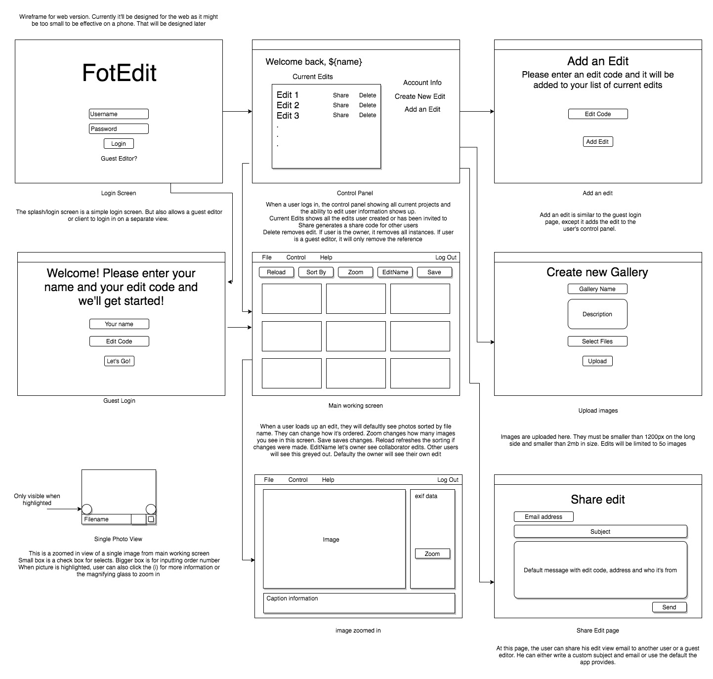
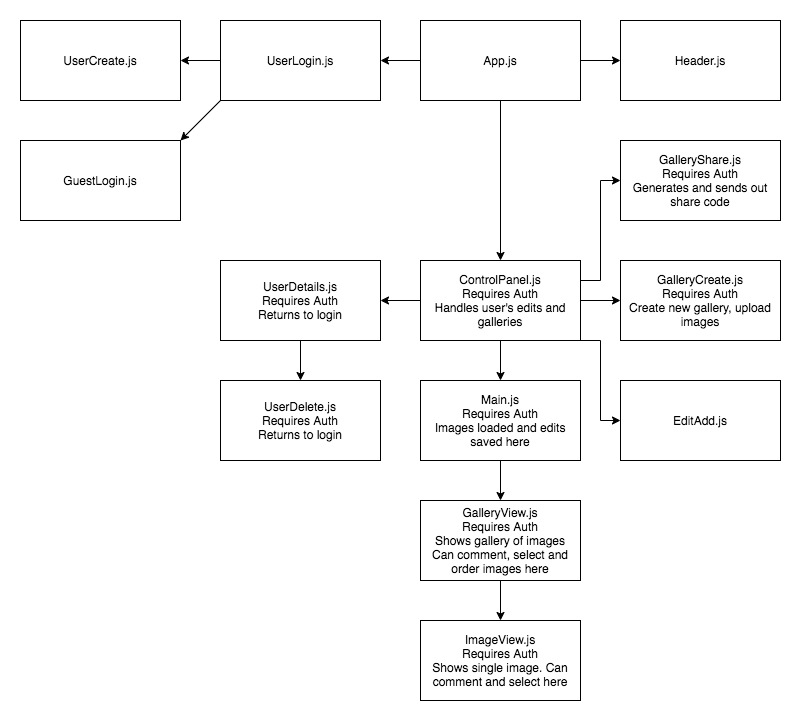
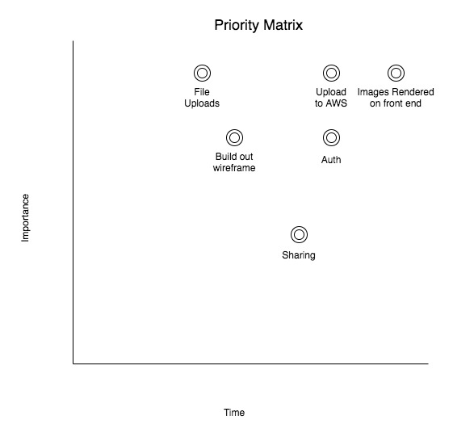

## FotEdit

FotEdit is an app that allows users to easily share their photo edits with others and compare the different edits. 

Users can upload photos (currently limited to 1200px and up to 50 photos).

They are initially displayed by file name order.

From there the user can rearrange photos, tag them with numbers or add colors to them. They can also attach comments or critiques to specific photos to explain their choices.

Owners of galleries can share out their galleries for other people to edit. These edits will create a new instance of the gallery and not touch the original.

### Interface

Currently it will be developed in ReactJS with a Ruby on Rails backend. It will eventually be ported to React Native for Tablets and mobile.

Images will be stored on AWS.

Users will need be authenticated and checked for authorization.

Guest users can only view specific gallery they have the share code for. If a user doesn't log in, the guest session will be created temporarily as a tempUser, but session will not persist.

### Wireframes 

These wireframes will be for desktop and tablet views. They will look similar with slightly different views based on screen size. Mobile will initially load tablet version. The nature of the app will not be ideally useable on smaller devices.

### Functionality Goals

#### *MVP*

- get wireframe built out
- get Rails backend working to handle image uploads
- get React working to display images
- images can be reordered by number or drag order
- images can have comments or checks
- user can share out galleries with unique share codes
- Rails stores images on cloud 
- create new users, login, delete or edit account details

#### *Post MVP*

- persist sessions, guest sessions
- drag to reorder images
- OAuth 
- later social aspect will be added so users in a group can be invited for an edit

#### *Post Post MVP (near future features)*

- refactor for react native
- add unlimited size and number of images upload
- email confirmation of shares, new gallery created
- pay structure for heavy users

### React Component Hierarchy

#### Components
| Component Name | Description         |
|----------------|---------------------|
| App            | Top Level Component |
| UserLogin      | Logs in user or guest login |
| UserCreate     | Creates a new user |
| Header         | Shared header      |
| ControlPanel   | User info and brains of the app |
| UserDelete     | Deletes user        |
| GalleryShare   | Generates share code, shares with others |
| Main           | Loads images and allows gallery operations |
| GalleryCreate  | User uploads images and creates galleries |
| GalleryView    | Overview of images, displays and allows editing here. Images can be sorted, tagged and ordered here |
| ImageView      | View single image. User can zoom in, comment or select images | 

### Rails Controllers / Routes 

UserController
GalleryController
EditController
PhotoController

#### Routes

| Controller | Operation | VERB | Route |
|-------|---------|------------|---------|
| User  | #view | GET | /user/:id|
| User | #create | POST | /user |
| User | #update | Put | /user/:id |
| User | #delete | DELETE | /user/:id |
| Gallery | #index | GET | /user/:id/gallery
| Gallery | #view | GET | gallery/:id|
| Gallery | #create | POST | gallery |
| Gallery | #update | Put | gallery/:id |
| Gallery | #delete | DELETE | gallery/:id |
| Edit  | #view | GET | gallery/:id/edit/:id|
| Edit | #create | POST | gallery/:id/edit |
| Edit | #update | Put | gallery/:id/edit/:id |
| Edit | #delete | DELETE | gallery/:id/edit/:id |
| Photo  | #view | GET | /photo/:id|
| Photo | #create | POST | /photo |
| Photo | #update | Put | /photo/:id |
| Photo | #delete | DELETE | /photo/:id |

#### Priority Matrix

#### Time Frames
| Component | Priority | Estimated Time | Time Invested | Actual |
|-----|-----|------|------|------|
| Wireframe | H | 12 hrs | | |
| File Uploads (Front End) | H | 6 hrs | | |
| Upload to AWS | H | 12 hrs | | | 
| Images retrieved and rendered front end | H | 8 hrs | | |
| User Auth | H | 12 hrs | | |
| Sharing | M | 5 hrs | | |
| Total | | 55 hrs | | |

### Project Schedule
| Day | Deliverable | Status |
|------|------------|------------|
| March 5 | Project approval | |
| March 6 | Wireframe built out | |
| March 7-8 | Rails server + File uploading working | |
| March 9 | User Auth | | 
| March 10 | Front End Functional (Images loading) | |
| March 11 | Front End Fully Functional + Sharing | |
| March 12 | Bug Fixing and styling | |

## Additional Libraries
### React

- Axios
- React Router 
- React-Draggable

### Rails

- Exif-js or exif-reader
- CORS
- bcrypt

### ERD

### Issues and Resolutions

- Potential issue - if a guest editor closes out their edit by accident, how will they re-access their edit? Generate an instance code? Maybe allow guest user to see other edits?
